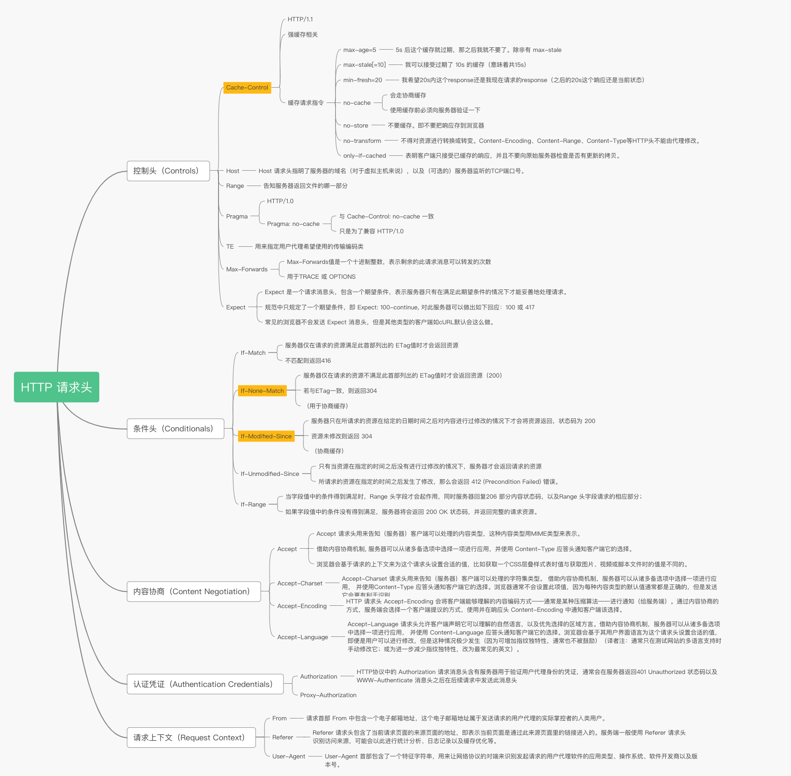

# HTTP

## 常见的请求方法

HTTP 1.0

- GET：从指定的资源请求数据
- POST：向指定的资源提交要被处理的数据，例如
  - 提交表单
  - 将消息发布到公告板，新闻组，邮件列表，博客或类似的文章组；
- HEAD

  - 类似于get请求，只不过返回的响应中没有具体的内容，只有头部
  - 只请求资源的首部
  - 检查超链接的有效性
  - 检查网页是否被修改

HTTP1.1

- PUT：替换或创建指定资源
- DELETE：对指定资源进行删除

HTTP2.0

- OPTIONS： 用于获取目的资源所支持的通信选项，比如说服务器支持的请求方式等等。

- TRACE：实现沿通向目标资源的路径的消息环回（loop-back）测试 ，提供了一种实用的 debug 机制。

- CONNECT

  - 为代理服务器准备的

  - 在 HTTP 协议中，**`CONNECT`** 方法可以开启一个客户端与所请求资源之间的双向沟通的通道。它可以用来创建隧道（tunnel）。

    例如，**`CONNECT`** 可以用来访问采用了 [SSL](https://developer.mozilla.org/en-US/docs/Glossary/SSL) ([HTTPS](https://developer.mozilla.org/zh-CN/docs/Glossary/https)) 协议的站点。客户端要求代理服务器将 TCP 连接作为通往目的主机隧道。之后该服务器会代替客户端与目的主机建立连接。连接建立好之后，代理服务器会面向客户端发送或接收 TCP 消息流。

所有通用服务器必须支持GET和HEAD方法。所有其他方法都是可选的。

- 安全性：在[此规范](https://tools.ietf.org/html/rfc7231#section-4.1)定义的请求方法中，GET，HEAD，OPTIONS和TRACE方法被定义为安全的
- 幂等性：PUT，DELETE和安全Method是幂等的。
- 可缓存性：GET, HEAD, and POST。但大多数是只实现GET和HEAD可缓存
  - 表示浏览器是会自动缓存的，以应用于后续请求。除非response中有相关策略

## GET 和 POST 的区别

get参数通过url传递，post放在request body中。

get请求在url中传递的参数是有长度限制的，而post没有。

get比post更不安全，因为参数直接暴露在url中，所以不能用来传递敏感信息。

get请求只能进行url编码，而post支持多种编码方式

get请求会浏览器主动cache，而post支持多种编码方式。

get请求参数会被完整保留在浏览历史记录里，而post中的参数不会被保留。

GET和POST本质上就是TCP链接，并无差别。但是由于HTTP的规定和浏览器/服务器的限制，导致他们在应用过程中体现出一些不同。

## HTTP  状态码

- 1xx (Informational): 收到请求，正在处理
- 2xx (Successful): 该请求已成功收到，理解并接受
- 3xx (Redirection): 重定向
- 4xx (Client Error): 该请求包含错误的语法或不能为完成
- 5xx (Server Error): 服务器错误

## 301 和 302 有什么具体区别

301：永久移动，请求的网页已永久移动到新的位置，服务器返回此响应，会自动将请求者转到新位置

302：历史移动，服务器目前从不同位置的网页响应请求，但请求者应继续使用原有位置来继续以后的请求，

## HTTP 常用请求头

## HTTP2

（这篇文章比较清楚：https://developers.google.com/web/fundamentals/performance/http2）

**HTTP/2** 是 [HTTP 网络协议](https://developer.mozilla.org/en-US/docs/Web/HTTP/Basics_of_HTTP)的一个重要版本。 HTTP/2的主要目标是

1. 通过启用完整的请求和响应多路复用来减少 [延迟](https://developer.mozilla.org/zh-CN/docs/Glossary/延迟)
2. 通过有效压缩HTTP标头字段来最小化协议开销
3. 增加对请求优先级和服务器推送的支持。

为了达到减少 50% 页面加载时间的目标，SPDY 引入一个新的二进制分帧层，以实现请求和响应复用、优先级和标头压缩，目的是更有效地利用底层 TCP 连接；请参阅[延迟是性能瓶颈](https://hpbn.co/primer-on-web-performance/#latency-as-a-performance-bottleneck)。

### 二进制分帧层

HTTP/2 将 HTTP 协议通信分解为二进制编码帧的交换，这些帧对应着特定数据流中的消息。所有这些都在一个 TCP 连接内复用。 这是 HTTP/2 协议所有其他功能和性能优化的基础。

- 请求与响应复用

  - 在 HTTP/1.x 中，如果客户端要想发起多个并行请求以提升性能，则必须使用多个 TCP 连接（请参阅[使用多个 TCP 连接](https://hpbn.co/http1x/#using-multiple-tcp-connections)）。 这是 HTTP/1.x 交付模型的直接结果，该模型可以保证每个连接每次只交付一个响应（响应排队）。 更糟糕的是，这种模型也会导致队首阻塞，从而造成底层 TCP 连接的效率低下。

    HTTP/2 中新的二进制分帧层突破了这些限制，实现了完整的请求和响应复用：客户端和服务器可以将 HTTP 消息分解为互不依赖的帧，然后交错发送，最后再在另一端把它们重新组装起来。

- 数据流优先级

### 服务器推送

所有服务器推送数据流都由 `PUSH_PROMISE` 帧发起，表明了服务器向客户端推送所述资源的意图，并且需要先于请求推送资源的响应数据传输。 这种传输顺序非常重要：客户端需要了解服务器打算推送哪些资源，以免为这些资源创建重复请求。 满足此要求的最简单策略是先于父响应（即，`DATA` 帧）发送所有 `PUSH_PROMISE` 帧，其中包含所承诺资源的 HTTP 标头。

### 标头压缩

每个 HTTP 传输都承载一组标头，这些标头说明了传输的资源及其属性。 在 HTTP/1.x 中，此元数据始终以纯文本形式，通常会给每个传输增加 500–800 字节的开销。如果使用 HTTP Cookie，增加的开销有时会达到上千字节。 （请参阅[测量和控制协议开销](https://hpbn.co/http1x/#measuring-and-controlling-protocol-overhead)。） 为了减少此开销和提升性能，HTTP/2 使用 HPACK 压缩格式压缩请求和响应标头元数据